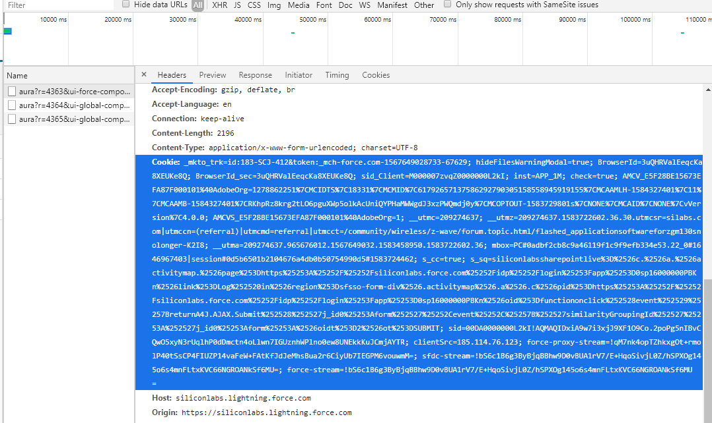
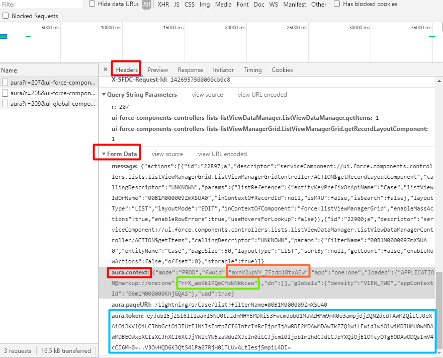
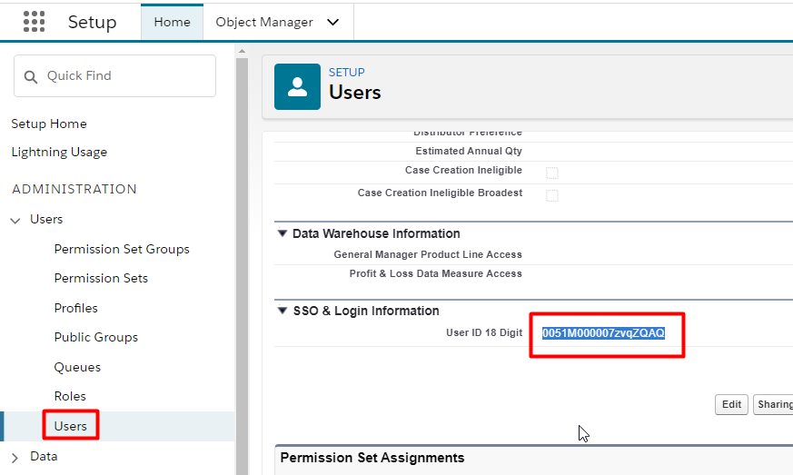
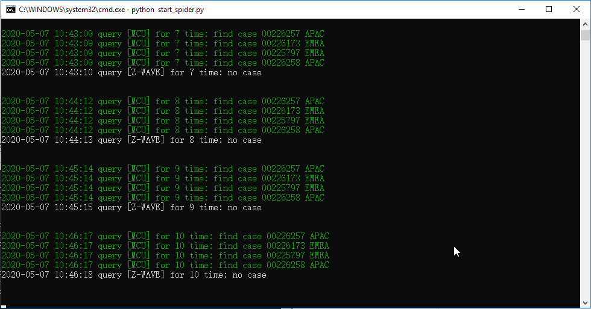

"# spider_salesforce" 

Make sure you log into the saleforce and stop in the queue you want
# Climbing web info
* click F12 to enter chrome debug mode, choose NetWork tab and clean all log in window.
* Fresh queue (Not F5)
# Find cookies, token and loadID
* After fresh, you will find a item in debug window, choose it. You will find all kinds of paramter in Header tab.
* Please find 3 important parameter in headers.

Please see the picture below to know how to get cookies.

Please see the picture below to know how to get loadID and token.

# Find Queue id, user id
Queue id can be found in your link address, such as https://siliconlabs.lightning.force.com/lightning/o/Case/list?filterName=00B1M0000096zClUAI
"00B1M0000096zClUAI" is the queue id.

User id can be found it your user page.

# Fill up paramter into python file
Open webinfo_salesforce.py and fill up the 5 paramters above.

# Add number to take_list
Add the mantissa number into take_list, spider will pick these case and give to you.

# Start run
python start_spider

# Note
* If the spider run correctly, it will output the caputure result. When the case number in take_list and belong to APAC, the case will be assigned to you by spider.

* Spider caputre the case info every 1 minute
* We can log into salesforce since we feed it cookies(include token and loadID)  from chrome, the cookies has life cycle, about 2-3 days. That means you may need to feed them again after the cookies became invalid.

Please contact if it can't work on your side

Welcome add more feature to the code to make it more friendly.